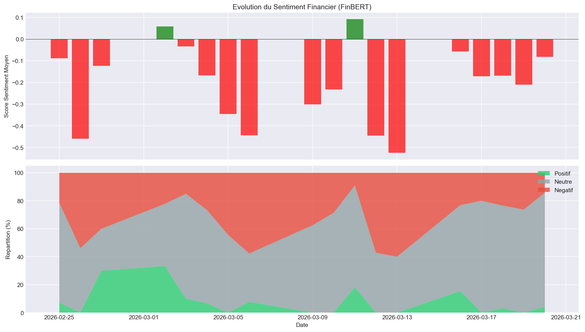
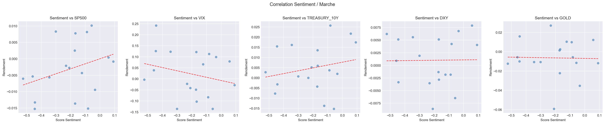
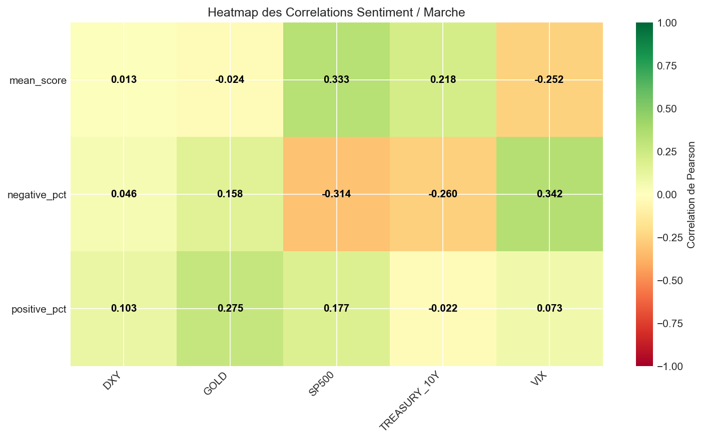

# Economic Sentiment Analyzer

---

## Objectif

Ce projet cherche à répondre à une question simple :
**Le ton des actualités financières a-t-il un lien mesurable avec les mouvements du marché ?**

Le pipeline collecte automatiquement des articles financiers, évalue leur sentiment grâce à un modèle d'intelligence artificielle spécialisé en finance, puis mesure statistiquement la corrélation avec les données boursières réelles.

---

## Purpose

This project aims to answer a simple question:
**Does the tone of financial news have a measurable link with market movements?**

The pipeline automatically collects financial articles, evaluates their sentiment using an AI model specialized in finance, and then statistically measures the correlation with real stock market data.

---

## How It Works

The project runs in 5 sequential steps:

### 1. Article Collection
- Automatic retrieval of financial headlines via **Google News**
- Targeted keywords: *stock market, economy, inflation, Fed, earnings...*
- Configurable collection window (25 days by default)

### 2. Sentiment Analysis
- Each headline is evaluated by **FinBERT**, an NLP model pre-trained specifically on financial texts
- Each article receives a score between **-1** (very negative) and **+1** (very positive)
- Scores are then aggregated daily (mean, standard deviation, volume)

### 3. Market Data
- Historical price retrieval via **Yahoo Finance** (`yfinance` library)

| Indicator | Ticker | Description |
|---|---|---|
| S&P 500 | `^GSPC` | 500 largest US companies |
| VIX | `^VIX` | Volatility index ("fear index") |
| Treasury 10Y | `^TNX` | US 10-year government bond yield |
| Dollar (DXY) | `DX-Y.NYB` | Dollar strength against other currencies |
| Gold | `GC=F` | Safe haven asset in times of uncertainty |

- Calculation of daily returns (% change)

### 4. Statistical Correlation
- Merging sentiment and market data by date
- **Pearson** and **Spearman** correlation calculations
- Statistical significance testing (p-value < 0.05)
- Lagged analysis (does today's sentiment predict tomorrow's market?)

### 5. Visualization & Report
- Chart generation: time series, scatter plots, correlation heatmaps
- Text report summarizing key findings

---

## Sample Results

### Sentiment Timeline



### Sentiment & Market Time Series


### Correlation Heatmap



---

## Project Structure

```text
economic-sentiment/
│
├── main.py                  # Entry point - runs the full pipeline
├── requirements.txt         # Python dependencies
│
├── src/
│   ├── scraper.py           # Article collection (Google News)
│   ├── sentiment.py         # Sentiment analysis (FinBERT)
│   ├── market.py            # Market data (Yahoo Finance)
│   ├── correlator.py        # Statistical calculations
│   └── visualizer.py        # Charts and report
│
├── data/                    # Generated data (CSV)
├── results/                 # Charts and report output
└── README.md
```


---

## Installation

```bash
# Create a virtual environment
python -m venv venv
source venv/bin/activate        # Linux/Mac
venv\Scripts\activate           # Windows

# Install dependencies
pip install -r requirements.txt


#usage

python main.py
